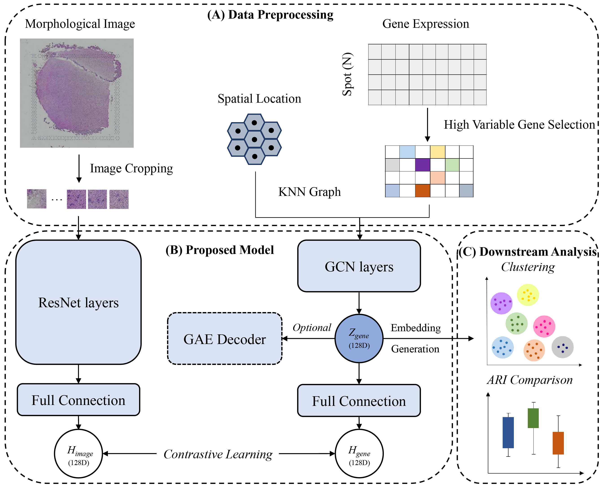

# Spatial-ConGR

## A contrastive learning approach to integrate spatial transcriptomics and H&E data for single-cell analysis

ConGcR and ConGaR, which are contrastive learning-based models, can effectively integrate spatial multi-omics data with gene expression, spatial location and morphology image to model embedded representations for more accurate spatial tissue architecture identification. The main workflow is shown as follows:



--------------------------------------------------------------------------------

## System Requirements:

ConGcR and ConGaR were implemented on a computing server with 2.2 GHz, 144 cores CPU, 503 GB RAM and one NVIDIA TU102 [TITAN RTX] GPU under an ubuntu 18.04 operating system.

### OS Requirements: 

ConGcR and ConGaR can run on both Linux and Windows. The package has been tested on the Linux system.

### Install Spatial-ConGR from Github:

```bash
git clone https://github.com/YuLin-code/Spatial-ConGR.git
cd Spatial-ConGR
```

### Python Dependencies: 

ConGcR and ConGaR depend on the Python (3.6+) scientific stack and python virutal environment with conda (<https://anaconda.org/>) is recommended.

```shell
conda create -n Spatial_ConGR python=3.8
conda activate Spatial_ConGR
pip install -r requirements.txt
```

## Examples:

### 1. Benchmark Methods

Directly clustering, adding and concatenating the preprocessed features of two modalities were used as the original clustering and baseline spatial multi-omics data integration methods in this study. The full resolution H&E images of 12 published human brain samples can be downloaded from the website: http://research.libd.org/spatialLIBD, please put them into the directory of 'Dataset/Human_Brain/image_data_folder/'. Run the following command to generate the baseline spatial domain identification results and we take '151507' as the example sample with raw gene expression and gray-scale image.

```bash
cd Benchmark_Methods
python Benchmark_Method_HB.py -sample 151507 -transform_opt raw -image_type gray 
```

### 2. ConGcR and ConGaR Models

We take the examples of ConGcR and ConGaR with raw gene expression, batch_size is 64, model_epoch is 5 and other hyper-parameter settings are default in human brain dataset case. If you want to use GPU to run the models, please set the hyper-parameter of device as cuda and configurate the environment as the Pytorch with CUDA enabled. Here we use the following settings to demo purposes:

- **transform_opt** defines the normalization method on gene expression input.
- **batch_size** defines the number of batch size in the model training process.
- **model_epoch** defines the number of epoch in the model training process.
- **w_rna_image** defines the weight of simclr loss using the features of two modalities in the final loss.
- **w_rna_gae** defines the weight of gae loss using gene expression in the final loss.
- **device** defines the device that is used for training model.

```bash
cd ..
cd ConGR_Human_Brain
python ConGR_Train_HB.py -sample 151507 -transform_opt raw -batch_size 64 -model_epoch 5 -w_rna_image 1 
python ConGR_Train_HB.py -sample 151507 -transform_opt raw -batch_size 64 -model_epoch 5 -w_rna_image 1 -w_rna_gae 100
```

### 3. Embedding Dimensional Reduction and RGB Generation

Three embedding dimensional reduction methods of PCA, t-SNE and UMAP were applied to transform the embeddings into three-dimensional features, that were used to generate RGB images referencing the generation method in RESEPT. Here we use the application with PCA method in preprocessed features of raw gene expression to demo purposes:

```bash
cd ..
cd Dimensional_Reduction_and_Generate_RGB
python original_pre_emb_pca.py -sample 151509 -transform_opt raw
python transform_embedding_to_RGB.py -sample 151509 -transformDimMethod pca -transform_opt raw
```

More information can be checked at the [tutorial](https://github.com/YuLin-code/Spatial-ConGR/tree/master/tutorial).

## References:

1. GCN <https://github.com/tkipf/pygcn>
2. SimCLR <https://github.com/HobbitLong/SupContrast>
3. Concerto <https://github.com/melobio/Concerto-reproducibility>
4. RESEPT <https://github.com/OSU-BMBL/RESEPT>
5. stMVC <https://github.com/cmzuo11/stMVC>